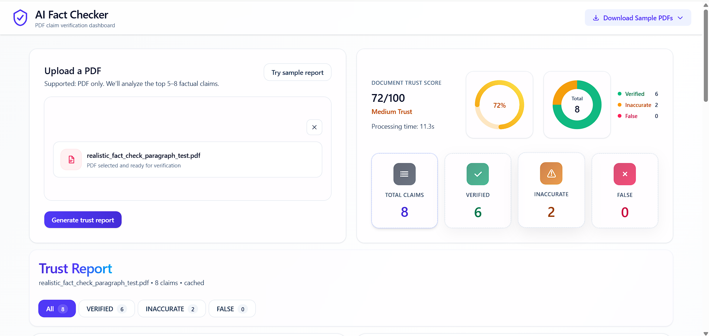
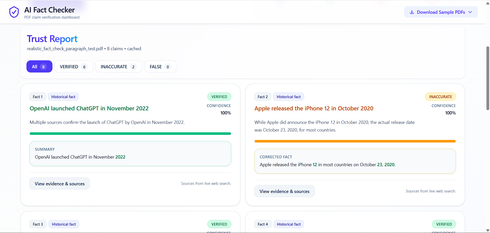
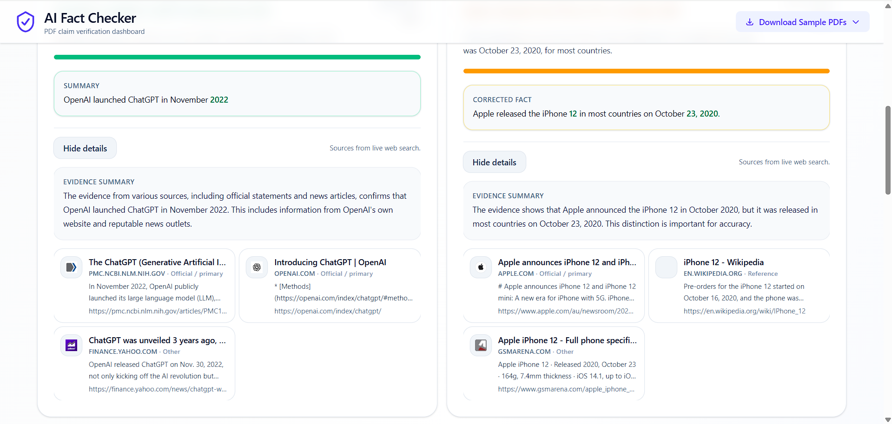

# AI Fact-Checking Web App (Groq)

Fast, token-efficient full-stack fact-checking app for PDF documents.

## Project Features

- Upload PDF files via drag-and-drop or file picker
- One-click sample report loading for quick demos
- AI-powered claim extraction and verification pipeline
- Confidence scoring with supporting evidence summaries
- Cached fact-check responses to reduce repeated LLM usage
- Responsive, modern UI built with Tailwind CSS

## Stack

- Frontend: React + Vite + Tailwind CSS
- Backend: FastAPI + PyMuPDF + (Tavily or DuckDuckGo fallback) + Groq
- Model: `llama-3.3-70b-versatile`
- Deployment: single Render web service (FastAPI serves built frontend)

## Architecture

```text
/
  src/                 # React source
  public/              # static source assets for Vite
  dist/                # built frontend output (generated by npm run build)
  backend/
    app/
      main.py          # API + static serving + SPA fallback
      routes/
        factcheck.py   # /api/fact-check
```

## Efficient Pipeline

1. Upload PDF
2. Extract text with PyMuPDF
3. Truncate text (`MAX_PDF_CHARS`)
4. Extract top claims in one Groq call
5. Run lightweight search per claim
6. Verify all claims together in one Groq call
7. Return structured report with confidence and evidence summary
8. Cache responses to avoid repeated LLM calls

## Environment Variables

Backend (`backend/.env`):

```env
GROQ_API_KEY=
GROQ_MODEL=llama-3.3-70b-versatile
TAVILY_API_KEY=   # optional (fallback to DuckDuckGo when missing)
MAX_CLAIMS=8
WEB_RESULTS_PER_CLAIM=3
MAX_PDF_CHARS=12000
MAX_SNIPPET_CHARS=260
CACHE_TTL_SECONDS=1200
```

Frontend (`.env`, optional):

```env
# Empty means same-origin calls (recommended for single Render service)
VITE_API_BASE_URL=
```

## Local Development

Backend:

```bash
cd backend
python -m venv .venv
.venv\Scripts\activate
pip install -r requirements.txt
copy .env.example .env
uvicorn app.main:app --reload --port 8000
```

Frontend:

```bash
npm install
npm run dev
```

The Vite dev server proxies `/api` and `/health` to `http://localhost:8000`.

## API

- `GET /health`
- `POST /api/fact-check` with `multipart/form-data` field `file` (PDF)

## Single Render Deployment

Create **one** Render Web Service at repository root with:

- Build command:
  `npm install && npm run build && cd backend && pip install -r requirements.txt`
- Start command:
  `cd backend && uvicorn app.main:app --host 0.0.0.0 --port $PORT`

Set environment variables:

- `GROQ_API_KEY` (required)
- `TAVILY_API_KEY` (optional but recommended)
- any optional tuning vars from `backend/.env.example`

### How it works in production

- FastAPI serves API routes at `/api/*`
- FastAPI serves built frontend files from `dist/`
- Unknown non-API routes (for example `/report`) return `dist/index.html` for SPA refresh support
- Same origin for frontend and backend means no mixed-origin/CORS issues

## Sample PDFs

- `public/sample1.pdf`
- `public/sample2.pdf`

They are served by the frontend at `/sample1.pdf` and `/sample2.pdf`.

## Full Documentation

See `docs/DETAILED_DOCS.md`.

# Project Screenshots

<p align="center">
  
  
  
</p>